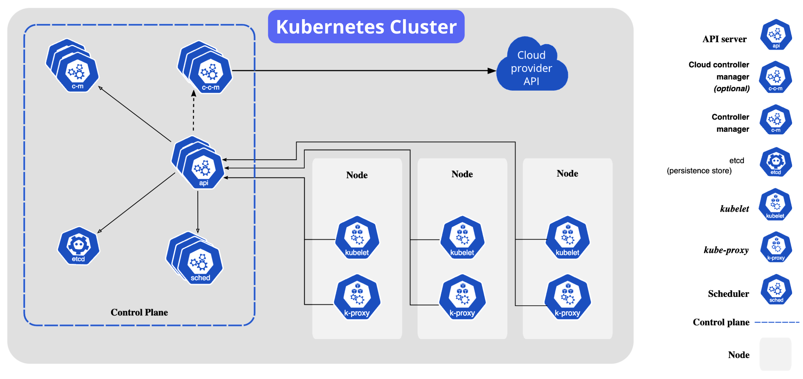

## K8s with Minikube



Staring with bootdev k8s course

- Images
- Configmaps
- Deployments
- Services
- Ingress
- Storage
- Namespaces

### Useful commands

`kubectl cluster-info`
`kubectl get nodes`


#### Start up minikube
```bash
minikube start --extra-config "apiserver.cors-allowed-origins=["http://boot.dev"]"
minikube dashboard --port=63840
```

#### Deploy an image
```bash
kubectl create deployment synergychat-web --image=bootdotdev/synergychat-web:latest
kubectl get deployments
kubectl get pods
kubectl port-forward $PODNAME 8080:8080
kubectl describe pod <pod-name>
```

#### Edit a deployment image
Allows you to edit the `yaml` file for the deployment
```bash
kubectl edit deployment synergychat-web
```

#### Use a proxy
```bash
kubectl get pods -o wide
kubectl proxy
http://127.0.0.1:8001/api/v1/namespaces/default/pods
```

### Deployments
```bash
kubectl get replicasets
kubectl get pods
kubectl get deployment synergychat-web -o yaml > web-deployment.yaml
# make changes, then apply them
kubectl apply -f web-deployment.yaml
```

### Services
```bash
kubectl apply -f web-service.yaml
kubectl port-forward service/web-service 8080:80
# svc is short for service
kubectl get svc web-service -o yaml
```

`ClusterIP` is the default service. There are other types of services like `NodePort` and `LoadBalancer`, etc.

### Ingress
```bash
minikube addons enable ingress
# Apply the ingress file, update the /etc/hosts file to point to the minikube ip
kubectl apply -f app-ingress.yaml
# Use the minikube tunnel to expose the service
minikube tunnel -c
```

### Persistent Volumes
```bash
kubectl apply -f api-pvc.yaml
kubectl get pvc
kubectl get pv
```

### Namespaces
```bash
kubectl get namespaces # or kubectl get ns

kubectl create ns crawler
kubectl -n crawler get pods
kubectl -n crawler get svc
kubectl -n crawler get configmaps
```

### Internal DNS
[DNS Entries](https://kubernetes.io/docs/concepts/services-networking/dns-pod-service/) are created for services and pods. The format is `<service-name>.<namespace>.svc.cluster.local`.

After updating the configmap, you may need to delete the pod and allow k8s to recreate it.

### Scaling
[Horizontal Pod Autoscaling](https://kubernetes.io/docs/tasks/run-application/horizontal-pod-autoscale/)

```bash
minikube addons enable metrics-server
kubectl -n kube-system get pod
kubectl top pods
kubectl get hpa
```

Generally speaking,
- Set memory requests ~10% higher than the average memory usage of your pods
- Set CPU requests to 50% of the average CPU usage of your pods
- Set memory limits ~100% higher than the average memory usage of your pods
- Set CPU limits ~100% higher than the average CPU usage of your pods
